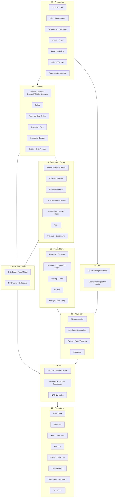
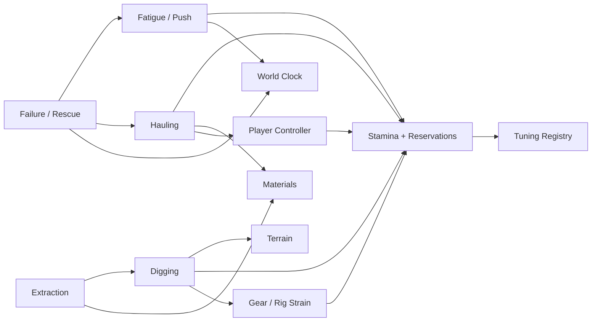
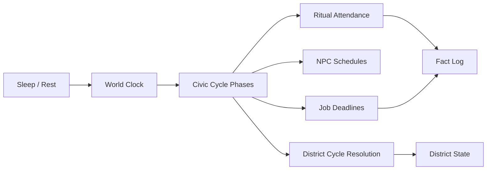
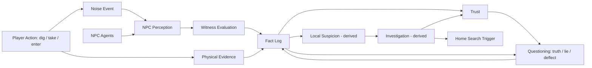
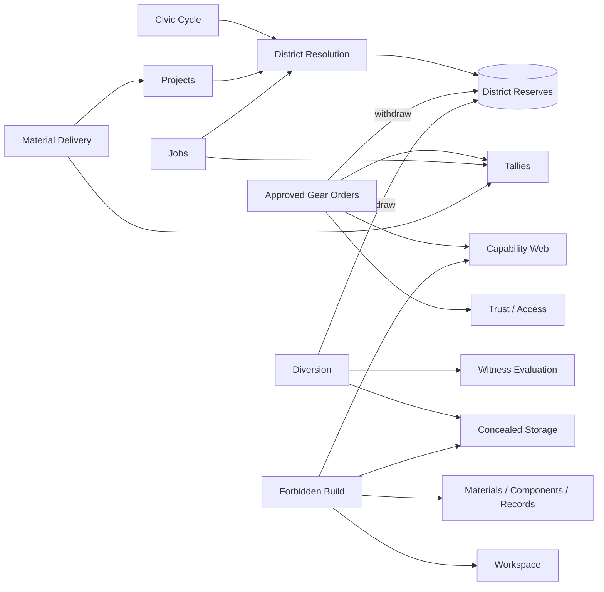
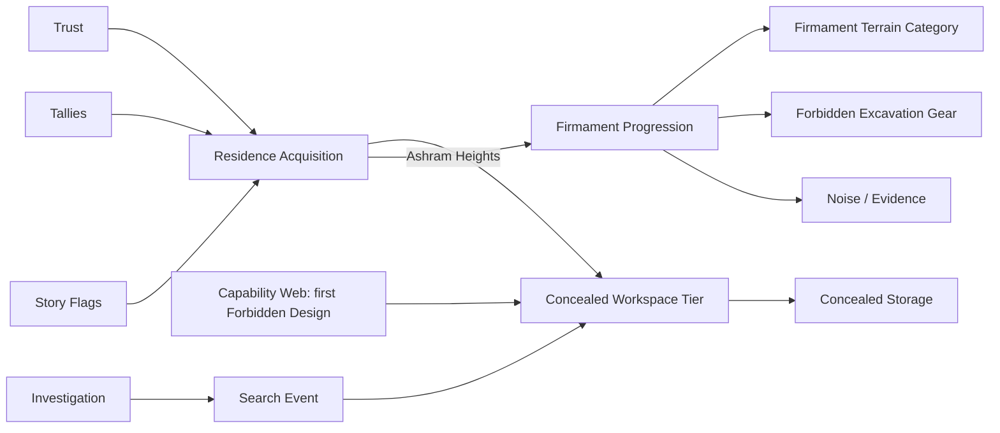

# Build Bible 00 — System dependency map

**Status:** DRAFT (AI-proposed, 2026-09-14) — pending USER review.
**Source:** [`../mechanics-canon.md`](../mechanics-canon.md). This map adds no mechanics; it orders and connects what the canon defines.
**Companion:** [`01-gap-decisions.md`](01-gap-decisions.md) — open decisions that block specific nodes (referenced as `G#`).

## Purpose

1. Decide **build order**: a system is specced and built only after everything it depends on has at least a contract (interface + stub + tests).
2. Assign **state ownership**: every piece of state has exactly one owner; other systems request changes through the owner's contract.
3. Show **which gaps block which systems**, so decisions happen before the spec that needs them.

Rules this map enforces:

- **Arrows mean "depends on / reads from".** `A --> B` means A needs B's contract to exist first.
- **No upward calls.** A lower layer never calls a higher one; it emits events that higher layers observe.
- **Three state layers** (per the planning discussion): **authoritative state** (what is true now), **fact log** (what happened, with metadata), **derived state** (computed from the first two, never saved as truth).
- **If a contract is missing, the implementing agent stops and reports it** instead of editing the other system.

---

## 1. Layer overview

Presentation (HUD, Trust view, district view, workbench UI, journal/map, world-state art modules) sits above all layers and only **reads** state and events.

---

## 2. Key dependency chains

### 2a. Body chain — movement to expedition cost

**Contract focus:** Stamina owns *all* reservations, keyed by `source_id` (hauling, rig_strain, fatigue). Hauling and Gear request reservations; they never touch the bar. Blocked by **G1, G2, G21, G13**.

### 2b. Time chain — clock to social rhythm

**Contract focus:** only the Clock advances time. Sleep, rescue, and failure **request** time advances; the Clock emits phase-transition events exactly once per transition. Blocked by **G3, G11, G10**.

### 2c. Transgression chain — action to consequence

**Contract focus:** perception and witness systems **only write facts**. Suspicion and investigation are **derived** from facts and never saved as truth. Trust is authoritative but changes only through named, reasoned events read from facts. Blocked by **G14, G16, G9, G4**.

### 2d. Economy chain — production to progression

**Contract focus:** the District owns District Reserves. Orders and Diversion both **request withdrawals** through the same contract, which is what makes legitimate and illicit draws compete. Blocked by **G4, G5, G6, G7, G8**.

### 2e. Home and Firmament chain

**Firmament state machine (draft):** `Inaccessible → Foreshadowed → Reachable (Ashram residence owned) → Excavation started → Partial breach (multi-session) → Breached`.

---

## 3. State ownership table

| State | Owner | Layer | Others may |
| --- | --- | --- | --- |
| Current time, phase | World Clock | Authoritative | Request advance |
| Stamina max, reservations by source, current usable | Stamina | Authoritative | Request/release reservation, spend |
| Fatigue amount, exhausted flag | Fatigue | Authoritative | Request add (Push), request recovery |
| Terrain deltas per chunk, deposit state | Terrain | Authoritative | Request dig/extract |
| Hauled loads, tether attachments | Hauling | Authoritative | Attach / detach / cache |
| Personal storage, concealed storage, caches | Storage | Authoritative | Deposit / withdraw with ownership tag |
| Equipped Gear, Core Improvements, Rig Capacity | Rig | Authoritative | Refit at stations only |
| District Capacity, Demand contributors, District Reserves (stock) | District | Authoritative | Request withdrawal, add project/contributor |
| Tallies | Wallet | Authoritative | Earn / spend |
| Trust value + reason list | Trust | Authoritative | Submit reasoned change events |
| Things that happened (seen, heard, missed, missing) | Fact Log | Historical | Append only |
| Suspicion, investigation stage, job availability, dialogue variant, standing label, district condition label | Their derived systems | Derived | Read only; never saved as truth |
| Known / Understood / Available per technology | Capability Web | Authoritative (Known/Understood) + Derived (Available) | Submit discovery events |
| Job instances + state machine | Jobs | Authoritative | Accept / progress / settle |
| Owned residences, workspace tier | Homes | Authoritative | Acquire / upgrade |
| Story flags, Firmament stage | Story / Firmament | Authoritative | Set via authored events |

---

## 4. Build order

Phases follow the layers. **Slice** is a proposed vertical-slice treatment (AI proposal, pending USER): **full**, **thin** (real contract, minimal content), **stub** (contract + fake implementation), **defer**.

| # | System | Depends on | Blocking gaps | Slice (proposed) |
| --- | --- | --- | --- | --- |
| 1 | Event Bus, Authoritative State, Fact Log, Tuning Registry, Content Definitions | — | — | full |
| 2 | Save / Load + versioning | 1 | G10 | full |
| 3 | Debug Tools framework | 1 | — | full (grows with each system) |
| 4 | World Clock | 1, 2 | G3, G11 | full |
| 5 | Authored Topology / Zones | 1 | camera/scale lock | thin (opening route) |
| 6 | Destructible Terrain + Persistence | 2, 5 | spike | thin (Bottom-West envelope) |
| 7 | Player Controller (reuse prototype) | 6 | — | full |
| 8 | Stamina + Reservations | 1, 7 | G2, G21 | full |
| 9 | Fatigue / Push / Recovery | 4, 8 | G2, G21 | thin |
| 10 | Interaction | 7 | — | full |
| 11 | Materials / Components / Records + Storage | 1, 2, 10 | G8 | thin (2 Materials, 1 Component, 1 Record) |
| 12 | Deposits + Extraction | 6, 11 | — | thin |
| 13 | Hauling + Tether + Caches | 8, 11 | G1, G13 | full (it's the core feel) |
| 14 | Rig + Gear + Capacity / Strain | 8, 1 | G6, G7 | thin (3 slots, ~4 Gear) |
| 15 | Civic Cycle / Pulse / Ritual | 4 | G3, G11 | thin |
| 16 | NPC Agents + Schedules + Navigation | 5, 6, 15 | G14, spike | thin |
| 17 | Perception (sight + noise) + Witness | 16, 1 | G14 | thin |
| 18 | Physical Evidence | 6, 1 | — | thin |
| 19 | Trust (+ reasons view) | 1 | G16 | thin |
| 20 | Suspicion + Investigation (derived) | 17, 18, 19 | G4 | stub (one authored investigation) |
| 21 | Dialogue + Questioning | 19, 1 | — | thin |
| 22 | Districts: Capacity / Demand / District Reserves | 15, 1 | G4, G5 | thin (Wickwork full, others stub) |
| 23 | Tallies + Approved Gear Orders | 22, 14, 19 | — | thin |
| 24 | Jobs + Commitments | 15, 11, 13, 22, 19 | — | thin (opening job) |
| 25 | Capability Web | 11, 1 | — | thin |
| 26 | Diversion / Theft + Concealed Storage | 22, 17, 11 | G8, G9 | thin (Wickwork racks) |
| 27 | Residences + Workspace | 19, 23, 26 | G8 | thin (Lower home only) |
| 28 | Forbidden Builds | 25, 26, 27, 14 | G7 | thin (one design) |
| 29 | Projects | 22, 11, 25 | G5 | stub |
| 30 | Failure / Rescue | 9, 13, 4, 17 | G22 | thin |
| 31 | Access / Gates | 19, story flags | — | thin |
| 32 | Firmament Progression | 27, 6, 14, 17 | — | defer (post-slice) |

---

## 5. Cycles to break by contract

These are places where two systems naturally want to call each other. Each is resolved by one-directional events.

| Apparent cycle | Resolution |
| --- | --- |
| Trust gates Jobs ↔ Job failure changes Trust | Jobs **emit** settlement facts; Trust **reads** facts. Jobs only **query** Trust. |
| Orders ↔ Diversion both drain District Reserves | District owns District Reserves and serves withdrawal requests; neither system knows about the other. |
| Stamina ↔ Hauling ↔ Gear | Stamina owns reservations by `source_id`; Hauling and Gear submit requests and never read each other. |
| Investigation ↔ Home search ↔ Workspace | Investigation emits a search-requested event; Homes resolves the search against the concealment tier and emits found-evidence facts. |
| Failure/rescue ↔ Clock ↔ Ritual | Failure requests a time advance; the Clock emits phase events; Ritual attendance reads them. Failure never marks Ritual missed directly. |
| Dialogue lies ↔ Facts ↔ Trust | Dialogue writes a `claim_made` fact; contradiction checks are derived; exposure emits a fact that Trust reads. |

---

## 6. Technical spikes that feed this map

Throwaway prototypes whose results set contracts for nodes 2, 6, 13, 16, and 17:

1. Persistent destructible terrain in chunks mixed with authored anchors.
2. Tethered hauling that stays readable and doesn't snag.
3. Perception + noise queries at target NPC counts.
4. Saving/loading terrain deltas + authoritative state + fact log with a schema version.
5. NPC navigation through terrain the player can change.
